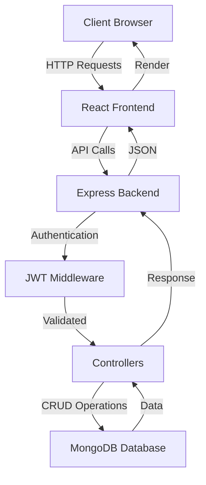
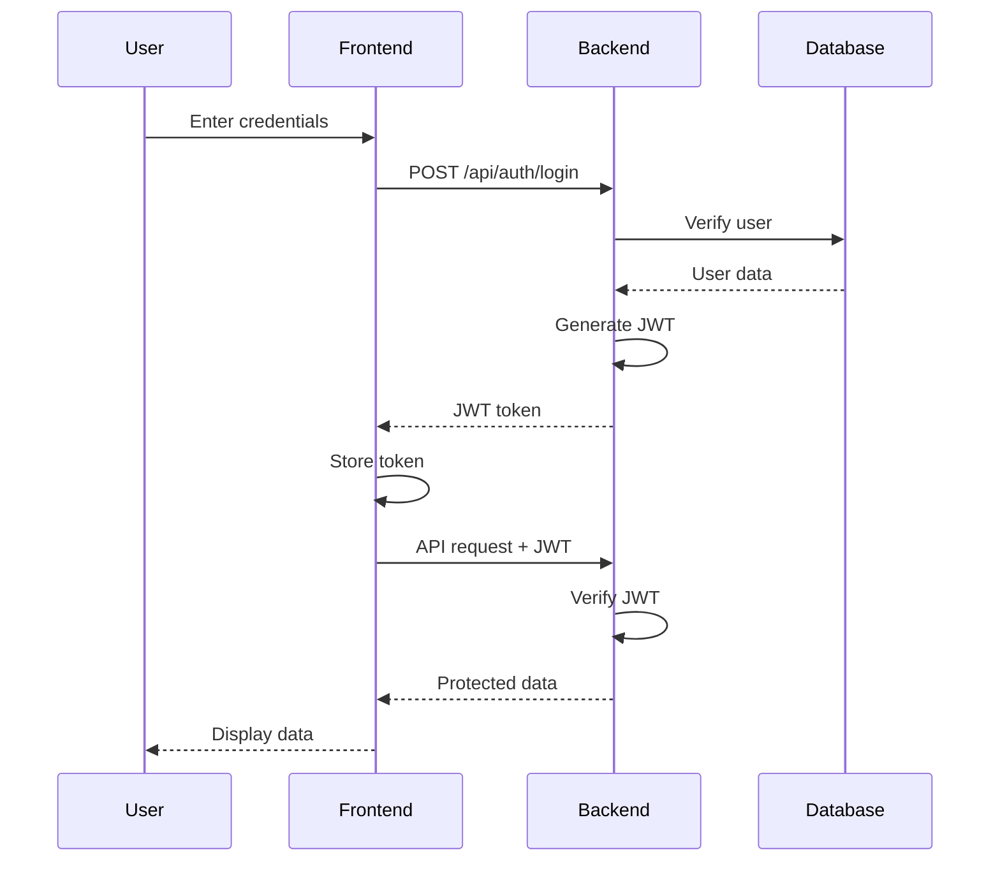

<div align="center">

# 🚀 FUTURE_FS_02

### Full-Stack MERN Web Application

[](https://react.dev/)
[](https://nodejs.org/)
[](https://www.mongodb.com/)
[](LICENSE)

**A modern, production-ready full-stack application built with the MERN stack, featuring secure JWT authentication, clean architecture, and scalable design patterns.**

[Features](#-features) • [Tech Stack](#tech-stack) • [Getting Started](#-getting-started) • [API Documentation](#-api-documentation) • [Roadmap](#-roadmap)

</div>

---

## 📖 Table of Contents

- [About the Project](#-about-the-project)
- [Features](#-features)
- [Tech Stack](#-tech-stack)
- [Project Architecture](#-project-architecture)
- [Getting Started](#-getting-started)
  - [Prerequisites](#prerequisites)
  - [Installation](#installation)
  - [Environment Setup](#environment-setup)
- [Usage](#-usage)
- [API Documentation](#-api-documentation)
- [Authentication Flow](#-authentication-flow)
- [Project Structure](#-project-structure)
- [Roadmap](#-roadmap)
- [Contributing](#-contributing)
- [License](#-license)
- [Contact](#-contact)
- [Acknowledgments](#-acknowledgments)

---

## 🎯 About the Project

**FUTURE_FS_02** is a comprehensive full-stack web application demonstrating modern web development best practices. Built with the MERN stack (MongoDB, Express.js, React, Node.js), this project showcases a complete **Business Management System** with features including lead tracking, inventory management, customer support ticketing, and interest request handling.

The application features **dual dashboards** - one for administrators with full control and analytics, and another for clients with limited, role-specific access. This makes it an ideal foundation for CRM systems, business management platforms, or SaaS applications.

### 💡 Why This Project?

- **Learn by Building**: Hands-on implementation of industry-standard patterns
- **Production-Ready**: Structured for real-world deployment and scalability
- **Security First**: JWT authentication with role-based access control
- **Modern Stack**: Latest versions of React, Node.js, and MongoDB
- **Clean Code**: Following MVC architecture and SOLID principles
- **Real-World Features**: Lead management, inventory tracking, support system

---

## ✨ Features

<table>
<tr>
<td>

### 🔐 **Authentication & Security**
- JWT-based authentication system
- Secure password hashing with bcrypt
- Protected routes with middleware
- Token-based session management
- Role-based access (Admin/Client)
- CORS configuration

</td>
<td>

### 🎨 **Frontend Excellence**
- Lightning-fast Vite build tool
- React 19 with modern hooks
- Responsive UI with Tailwind CSS
- Client-side routing
- Real-time notifications (React Hot Toast)
- Separate Admin & Client dashboards

</td>
</tr>
<tr>
<td>

### 🏗️ **Backend Architecture**
- Clean MVC pattern
- RESTful API design
- MongoDB with Mongoose ODM
- Environment-based configuration
- Error handling middleware
- Multiple controller modules

</td>
<td>

### 📊 **Core Features**
- **Lead Management**: Track and manage leads
- **Inventory System**: Manage inventory items
- **Support Tickets**: Customer support ticketing
- **Interest Requests**: Handle user inquiries
- **Dashboard Analytics**: Admin & client views
- **User Management**: Registration & profiles

</td>
</tr>
</table>

---

## 🛠️ Tech Stack

### **Frontend**

| Technology | Version | Purpose |
|------------|---------|---------|
|  | 19.x | UI Library |
|  | Latest | Build Tool |
|  | Latest | Styling |
|  | Latest | Routing |
|  | Latest | API Client |

### **Backend**

| Technology | Version | Purpose |
|------------|---------|---------|
|  | LTS | Runtime |
|  | 4.x | Web Framework |
|  | Latest | Database |
|  | Latest | Authentication |
|  | Latest | Password Hashing |

---

## 🏛️ Project Architecture



---

## 🚀 Getting Started

### Prerequisites

Before you begin, ensure you have the following installed:

- **Node.js** (v18.x or higher) - [Download here](https://nodejs.org/)
- **npm** or **yarn** - Comes with Node.js
- **MongoDB** - [MongoDB Atlas](https://www.mongodb.com/cloud/atlas) (free tier) or local installation
- **Git** - [Download here](https://git-scm.com/)

### Installation

1. **Clone the repository**

```bash
git clone https://github.com/your-username/FUTURE_FS_02.git
cd FUTURE_FS_02
```

2. **Install Backend Dependencies**

```bash
cd backend
npm install
```

3. **Install Frontend Dependencies**

```bash
cd ../frontend
npm install
```

### Environment Setup

Create a `.env` file in the **`backend/`** directory:

```env
# Server Configuration
PORT=5000
NODE_ENV=development

# Database
MONGO_URI=mongodb+srv://<username>:<password>@cluster.mongodb.net/future_fs_02?retryWrites=true&w=majority

# JWT Configuration
JWT_SECRET=your_super_secure_jwt_secret_key_min_32_chars
JWT_EXPIRE=7d

# Client URL (for CORS)
CLIENT_URL=http://localhost:5173
```

> ⚠️ **Security Note**: Never commit your `.env` file to version control. Use strong, unique values for `JWT_SECRET`.

---

## 💻 Usage

### Running the Development Servers

#### Backend Server

```bash
cd backend
npm run dev
```

✅ Backend running at: **http://localhost:5000**

#### Frontend Server

```bash
cd frontend
npm run dev
```

✅ Frontend running at: **http://localhost:5173**

### Building for Production

#### Frontend Build

```bash
cd frontend
npm run build
```

Optimized production files will be in `frontend/dist/`

---

## 📡 API Documentation

### Base URL

```
http://localhost:5000/api
```

### 🔐 Authentication Endpoints

#### Register User

```http
POST /api/auth/register
Content-Type: application/json

{
  "name": "John Doe",
  "email": "john@example.com",
  "password": "SecurePassword123!",
  "role": "client" // or "admin"
}
```

**Response:**
```json
{
  "success": true,
  "message": "User registered successfully",
  "token": "eyJhbGciOiJIUzI1NiIsInR5cCI6IkpXVCJ9...",
  "user": {
    "id": "64a5f2...",
    "name": "John Doe",
    "email": "john@example.com",
    "role": "client"
  }
}
```

#### Login User

```http
POST /api/auth/login
Content-Type: application/json

{
  "email": "john@example.com",
  "password": "SecurePassword123!"
}
```

#### Get Current User (Protected)

```http
GET /api/auth/me
Authorization: Bearer <token>
```

---

### 📋 Lead Management Endpoints

#### Get All Leads

```http
GET /api/leads
Authorization: Bearer <token>
```

#### Create Lead

```http
POST /api/leads
Authorization: Bearer <token>
Content-Type: application/json

{
  "name": "Jane Smith",
  "email": "jane@example.com",
  "phone": "+1234567890",
  "company": "Tech Corp",
  "status": "new" // new, contacted, qualified, converted
}
```

#### Update Lead

```http
PUT /api/leads/:id
Authorization: Bearer <token>
Content-Type: application/json

{
  "status": "contacted",
  "notes": "Follow up scheduled"
}
```

#### Delete Lead

```http
DELETE /api/leads/:id
Authorization: Bearer <token>
```

---

### 📦 Inventory Management Endpoints

#### Get All Inventory Items

```http
GET /api/inventory
Authorization: Bearer <token>
```

#### Add Inventory Item

```http
POST /api/inventory
Authorization: Bearer <token>
Content-Type: application/json

{
  "name": "Product Name",
  "sku": "SKU-001",
  "quantity": 100,
  "price": 29.99,
  "category": "Electronics"
}
```

#### Update Inventory

```http
PUT /api/inventory/:id
Authorization: Bearer <token>
Content-Type: application/json

{
  "quantity": 150,
  "price": 24.99
}
```

#### Delete Inventory Item

```http
DELETE /api/inventory/:id
Authorization: Bearer <token>
```

---

### 🎫 Support Ticket Endpoints

#### Get All Tickets

```http
GET /api/support
Authorization: Bearer <token>
```

#### Create Support Ticket

```http
POST /api/support
Authorization: Bearer <token>
Content-Type: application/json

{
  "subject": "Login Issue",
  "description": "Unable to login to my account",
  "priority": "high", // low, medium, high, urgent
  "category": "technical"
}
```

#### Update Ticket Status

```http
PUT /api/support/:id
Authorization: Bearer <token>
Content-Type: application/json

{
  "status": "in-progress", // open, in-progress, resolved, closed
  "response": "Working on the issue"
}
```

---

### 💼 Interest Request Endpoints

#### Get All Interest Requests

```http
GET /api/interest-requests
Authorization: Bearer <token>
```

#### Submit Interest Request

```http
POST /api/interest-requests
Authorization: Bearer <token>
Content-Type: application/json

{
  "product": "Product Name",
  "customerName": "John Doe",
  "email": "john@example.com",
  "message": "Interested in learning more"
}
```

#### Update Interest Request

```http
PUT /api/interest-requests/:id
Authorization: Bearer <token>
Content-Type: application/json

{
  "status": "contacted" // pending, contacted, converted, rejected
}
```

---

### Error Responses

```json
{
  "success": false,
  "message": "Error description",
  "error": "Detailed error message (development only)"
}
```

### Common Status Codes

| Code | Description |
|------|-------------|
| 200 | Success |
| 201 | Created |
| 400 | Bad Request |
| 401 | Unauthorized |
| 403 | Forbidden |
| 404 | Not Found |
| 500 | Server Error |

---

## 🔐 Authentication Flow



### How It Works

1. **Registration**: User creates account → Password hashed with bcrypt → Stored in MongoDB
2. **Login**: Credentials verified → JWT token generated → Token sent to client
3. **Storage**: Token stored in browser (localStorage/sessionStorage)
4. **Authorization**: Token included in request headers → Middleware validates → Access granted
5. **Expiration**: Token expires after set duration → User must login again

---

## 📁 Project Structure

```
FUTURE_FS_02/
│
├── 📂 backend/                     # Node.js/Express server
│   ├── 📂 config/                 # Configuration files
│   │   └── db.js                  # MongoDB connection
│   ├── 📂 controllers/            # Route controllers (business logic)
│   │   ├── authController.js      # Authentication logic
│   │   ├── interestRequestController.js
│   │   ├── inventoryController.js
│   │   ├── leadController.js
│   │   └── supportController.js
│   ├── 📂 middleware/             # Custom middleware
│   │   └── authMiddleware.js      # JWT verification
│   ├── 📂 models/                 # Mongoose schemas
│   │   ├── InterestRequest.js
│   │   ├── Inventory.js
│   │   ├── Lead.js
│   │   ├── SupportTicket.js
│   │   └── User.js
│   ├── 📂 routes/                 # API routes
│   ├── 📂 utils/                  # Utility functions
│   ├── 📂 node_modules/           # Dependencies
│   ├── .env                       # Environment variables
│   ├── package-lock.json
│   ├── package.json
│   ├── server.js                  # Entry point
│   └── vercel.json                # Vercel deployment config
│
├── 📂 frontend/                    # React application (Vite)
│   ├── 📂 public/                 # Static assets
│   ├── 📂 src/
│   │   ├── 📂 assets/             # Images, fonts, etc.
│   │   ├── 📂 components/         # Reusable UI components
│   │   │   ├── AdminNavbar.jsx
│   │   │   ├── ClientNavbar.jsx
│   │   │   ├── LeadForm.jsx
│   │   │   ├── LeadTable.jsx
│   │   │   ├── ProtectedRoute.jsx
│   │   │   ├── QuickActions.jsx
│   │   │   ├── RecentLeads.jsx
│   │   │   ├── Sidebar.jsx
│   │   │   └── StatCard.jsx
│   │   ├── 📂 pages/              # Page components
│   │   │   ├── AdminDashboard.jsx
│   │   │   ├── AdminSupport.jsx
│   │   │   ├── ClientDashboard.jsx
│   │   │   ├── InterestRequests.jsx
│   │   │   ├── Inventory.jsx
│   │   │   ├── Leads.jsx
│   │   │   ├── Login.jsx
│   │   │   └── Register.jsx
│   │   ├── 📂 services/           # API service layer
│   │   │   └── api.js
│   │   ├── App.jsx                # Root component
│   │   ├── main.jsx               # Entry point
│   │   └── index.css              # Global styles
│   ├── 📂 node_modules/           # Dependencies
│   ├── .gitignore
│   ├── eslint.config.js           # ESLint configuration
│   ├── index.html
│   ├── package-lock.json
│   ├── package.json
│   ├── README.md
│   ├── vercel.json                # Vercel deployment config
│   └── vite.config.js             # Vite configuration
│
├── 📄 .gitignore
├── 📄 README.md
└── 📄 LICENSE
```

### 📋 Key Directories Explained

#### **Backend**
- **`config/`** - Database and app configuration
- **`controllers/`** - Business logic for different features (auth, leads, inventory, support)
- **`middleware/`** - Authentication and request validation
- **`models/`** - MongoDB/Mongoose schemas for data models
- **`routes/`** - API endpoint definitions
- **`utils/`** - Helper functions and utilities

#### **Frontend**
- **`components/`** - Reusable UI components (Navbar, Forms, Tables, Cards)
- **`pages/`** - Full page components mapped to routes
- **`services/`** - API integration and HTTP client setup
- **`assets/`** - Static files like images and fonts

---

## 🗺️ Roadmap

### ✅ Completed
- [x] Basic MERN stack setup
- [x] JWT authentication system
- [x] Protected routes
- [x] User registration and login
- [x] Clean MVC architecture

### 🚧 In Progress
- [ ] Role-Based Access Control (RBAC)
- [ ] Refresh token implementation
- [ ] Email verification system

### 📋 Planned Features

#### **Phase 1: Enhanced Security**
- [ ] Two-Factor Authentication (2FA)
- [ ] Password reset via email
- [ ] Account verification
- [ ] Rate limiting
- [ ] Security headers (Helmet.js)

#### **Phase 2: Advanced Features**
- [ ] User profile management
- [ ] File upload (Cloudinary/AWS S3)
- [ ] Real-time notifications (Socket.io)
- [ ] Search and filtering
- [ ] Pagination
- [ ] Dark mode

#### **Phase 3: DevOps & Testing**
- [ ] Unit tests (Jest/Vitest)
- [ ] Integration tests
- [ ] E2E tests (Playwright)
- [ ] Docker containerization
- [ ] CI/CD pipeline (GitHub Actions)
- [ ] Monitoring (Winston/Morgan)

#### **Phase 4: Deployment**
- [ ] Frontend deployment (Vercel/Netlify)
- [ ] Backend deployment (Render/Railway)
- [ ] MongoDB Atlas setup
- [ ] Custom domain
- [ ] SSL certificate
- [ ] Performance optimization

---

## 🤝 Contributing

Contributions are what make the open-source community such an amazing place to learn, inspire, and create. Any contributions you make are **greatly appreciated**.

### How to Contribute

1. **Fork the Project**
2. **Create your Feature Branch** (`git checkout -b feature/AmazingFeature`)
3. **Commit your Changes** (`git commit -m 'Add some AmazingFeature'`)
4. **Push to the Branch** (`git push origin feature/AmazingFeature`)
5. **Open a Pull Request**

### Code Style

- Follow the existing code style
- Write meaningful commit messages
- Add comments for complex logic
- Update documentation as needed

---

## 📜 License

Distributed under the ISC License. See `LICENSE` file for more information.

---

## 👨‍💻 Contact

**Devansh Tiwari**  
Full-Stack Developer & AI SaaS Builder

- 💼 **Portfolio**: [My Portfolio](https://future-fs-02-pe62.vercel.app/login)
- 🐙 **GitHub**: [My Github](https://github.com/yo-soy-dev)
- 💼 **LinkedIn**: [My Linkedin](https://www.linkedin.com/in/yo-soy-dev)
- 📧 **Email**: devanshtiwari817@gmail.com
- 🐦 **X**: [My X](https://x.com/soy_yo_dev40)

**Project Link**: [https://github.com/yo-soy-dev/FUTURE_FS_02](https://github.com/yo-soy-dev/FUTURE_FS_02)

---

## 🙏 Acknowledgments

Special thanks to the following resources and communities:

- [React Documentation](https://react.dev/)
- [Express.js](https://expressjs.com/)
- [MongoDB University](https://university.mongodb.com/)
- [MDN Web Docs](https://developer.mozilla.org/)
- [Stack Overflow Community](https://stackoverflow.com/)
- [GitHub Markdown Guide](https://guides.github.com/features/mastering-markdown/)

---

## ⭐ Show Your Support

If you found this project helpful or learned something from it:

- ⭐ **Star this repository**
- 🍴 **Fork it** for your own projects
- 👀 **Watch** for updates
- 📢 **Share** with others
- 💬 **Provide feedback** via issues

---

<div align="center">

### 💡 Built with passion by developers, for developers

**Made with ❤️ using the MERN Stack**

[](https://github.com/yo-soy-dev/FUTURE_FS_02)
[](https://github.com/yo-soy-dev)

</div>
